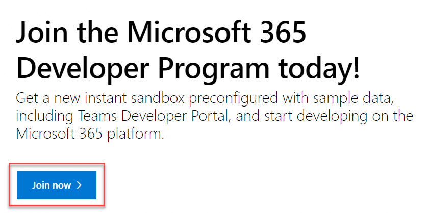
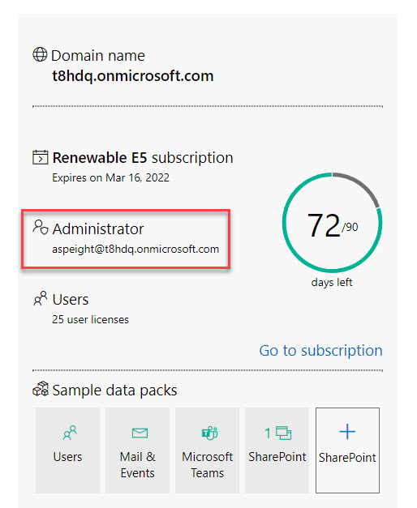
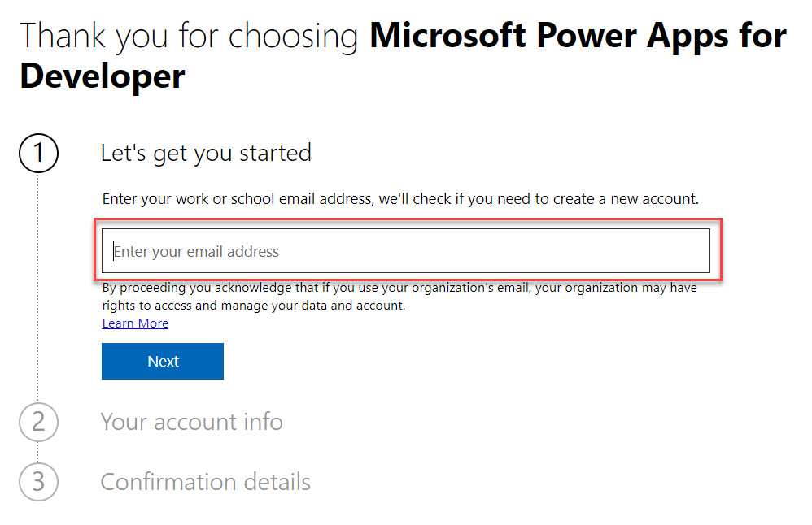
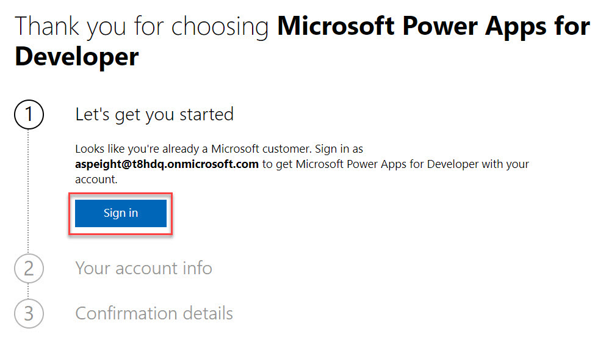
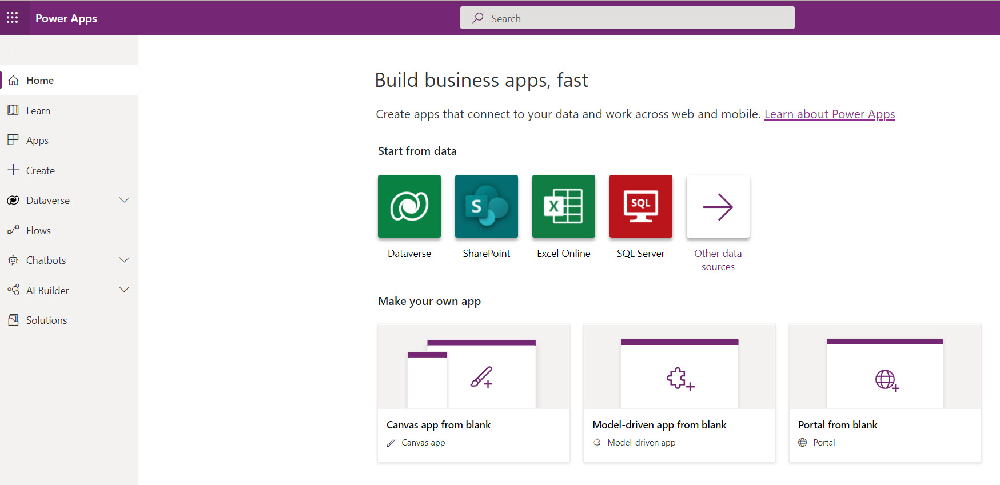

Thanks for joining us for our upcoming workshop! Using the Power Apps platform for this workshop requires that you have access to a sandbox environment. You can get a sandbox environment as part of the M365 Developer Program. Sign-up is free but does require a phone number for authentication to ensure that your account is protected. Follow the instructions below to create your own Microsoft tenant and gain access to the Power Apps portal.

## Sign-Up for the M365 Developer Program

1. Go to [developer.microsoft.com/microsoft-365/dev-program](https://developer.microsoft.com/microsoft-365/dev-program).
1. Click **Join now**.

    

1. Sign in to your Microsoft account or Create a Microsoft account

    **Note**: First try signing in with your school account as you may already have access to the platforms that’ll be used for this workshop. Alternatively, you can create a new account using your personal email address. If you’re creating a new account, you’ll need to validate the account with a phone number.

1. Complete the **Join the Microsoft 365 Developer Program!** form.
1. After your account is created, go to [developer.microsoft.com/microsoft-365/profile](https://developer.microsoft.com/microsoft-365/profile) to retrieve your username. If you are not signed in, sign in using your Microsoft account (the same credentials from **Step 3**).
1. Copy/Save the **Administrator** email address for signing into the Power Apps portal.

    

## Sign-Up for a Power Apps Community Plan

1. Go to [powerapps.microsoft.com/developerplan](https://powerapps.microsoft.com/developerplan).
1. Click **Get started free**.
1. For **Step 1**, enter your **M365 Dev Program** email address (the **Administrator** email address).
1
    
1. You should receive the following message:

    

    Click **Sign in** and sign-in using your M365 Dev Program credentials (the **Administrator** email address).

    **Note**: If you need to do a password reset, click Forgot my password.
1. After you sign in, click **Get Started**.

    

1. Select your country and click **Accept**.

    

1. Go to [make.powerapps.com](https://make.powerapps.com) to confirm that you can access the Power Apps portal.

    

## Download & Sign-In to Power Apps

1. Go to your phone’s app store.
1. Search for **Power Apps**
1. Download the app.
1. Sign-in using your M365 Dev Program credentials (the **Administrator** email address).
